Pitch:

>The player manages a scientific mission on the islands of an unknown planet, where he needs to use local resources, discover new technologies, build production and do everything to make a scientific discovery.

---

The player needs to find solutions to landscape challenges, balance defence and automatic production with noise pollution and following threats. Exploring local flora and fossil resources will pay off with new technology and new challenges.

---

Compile - is my biggest and most ambitious project in my career so far. I started it soon after stopping work on The Swap Engage.

To put it in perspective, Compile was in active development for over 3 years with almost 20k lines of code. Yes, manually written code. The quality of C# code I produced, especially the newer one, still keeps up with my current quality standards. Highly event- and data-driven code with good system design, clean responsibility separation, powerful abstractions, serializations, custom helper library...

To name a few, the game/project features:
- Optimized world generation with a lot of customization options and support for ores, vegetation, animal spawners and other features
- Fully custom lazy procedural flexible UI system, inspirted by immediate mode UI. It lets create UI layouts for every building or other needs with expressive syntax and no boilerplate, for the UI system to dynamically pick up tasks and render elements on need
- Isometric conveyor logic with awareness of and adaptivity to surroundings, as well as splitters, bridges, mergers, sorters, ziplines and sockets in between.
- Cargo ships with customizable routing and advanced navmesh AI for tuned movement. Other robots for gathering and researching flora
- Custom 3D isometric rendering pipeline using Blender and Python automation. It allows to create a model and render all necessary angles procedurally with one button.
- Full localization to 3 languages using Crowdin and Unity Localization Package
- Optimized isometric rendering of thousands of objects and lots of islands
- Extendible building development architecture, providing easy support and high robustness and reusability
- Enemy AI, stress-driven dynamic difficulty adjustments
- Noise pollution, generated by machinery and defence, spiking animals (enemies) stress
- Defence, automatic production driven by logistic, mining and processing buildings

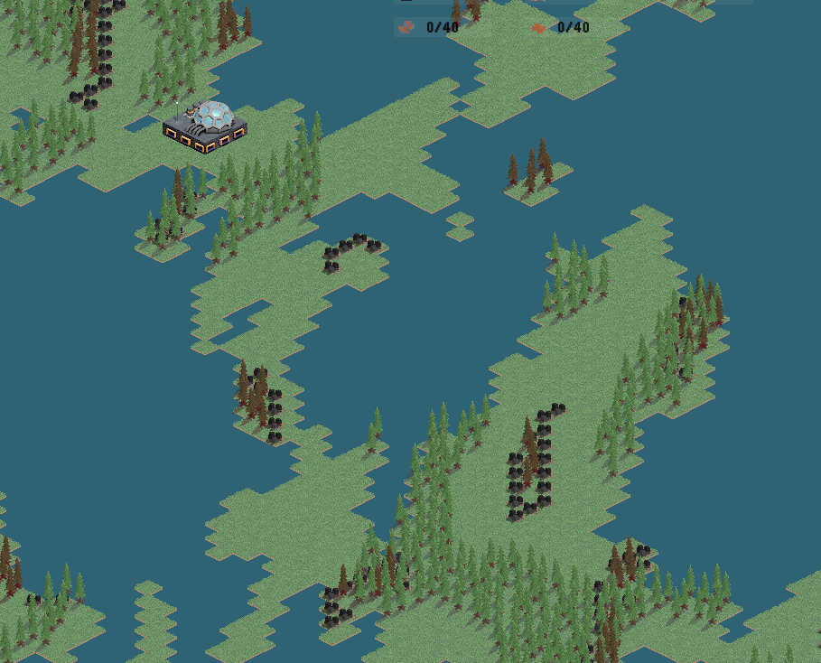
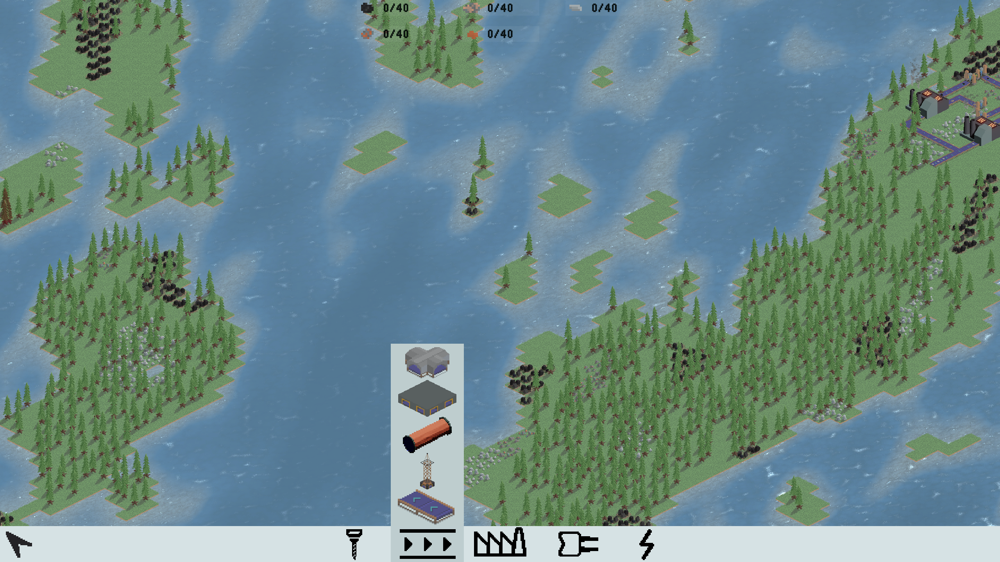
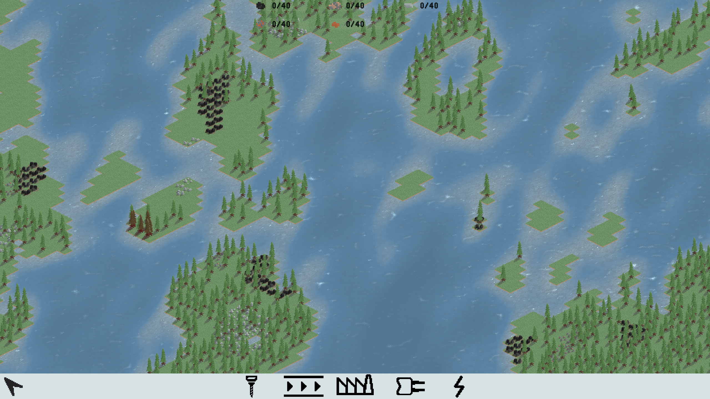

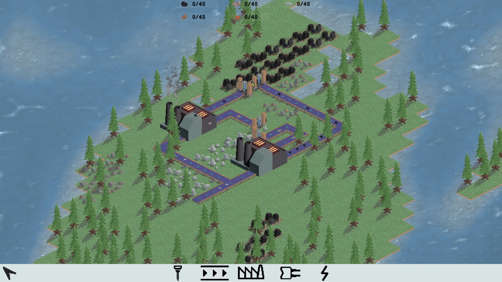
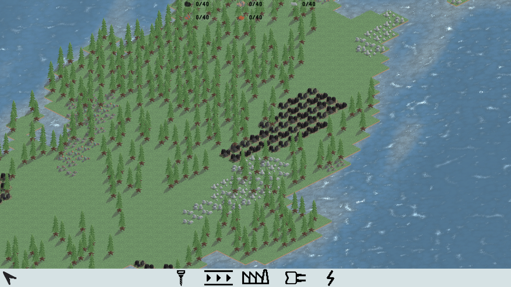
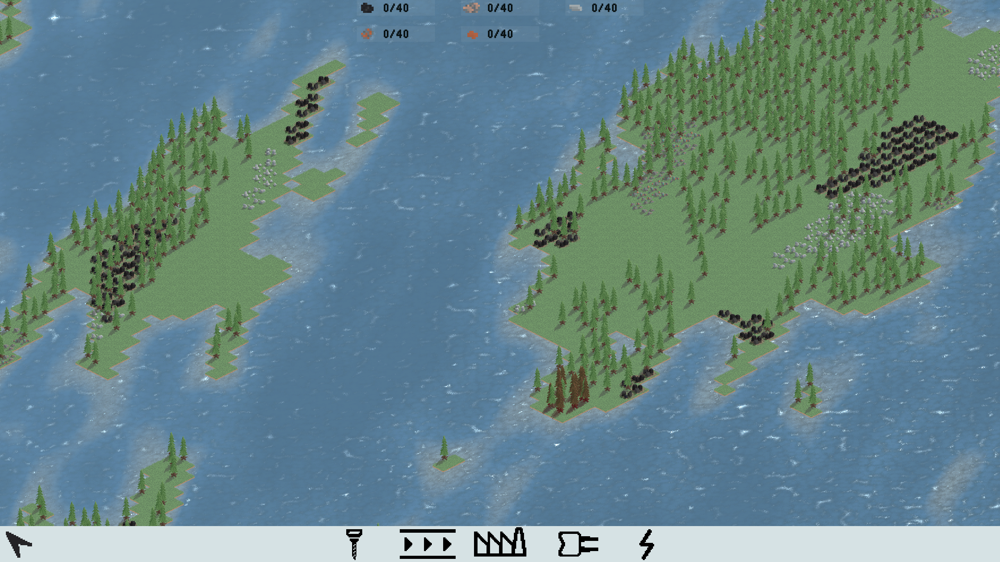

This is how I started with brainstorming: a giant Microsoft whiteboard, full of texts, sketches, ideas. Most of it isn't solidified - I always treated this space as a conversation with myself.

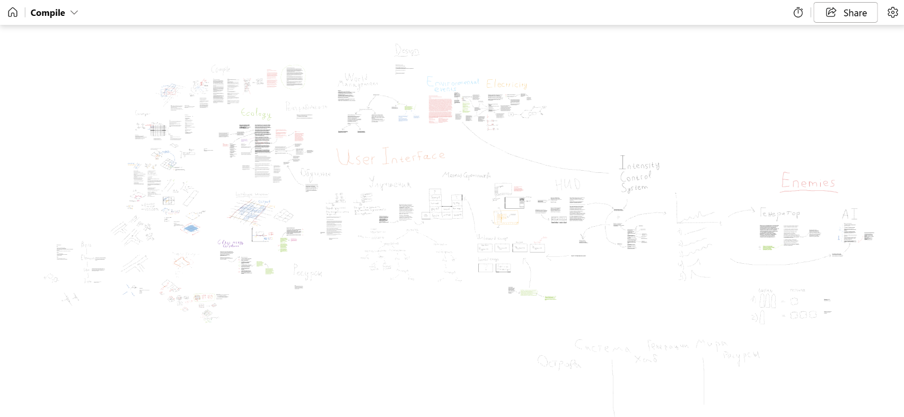

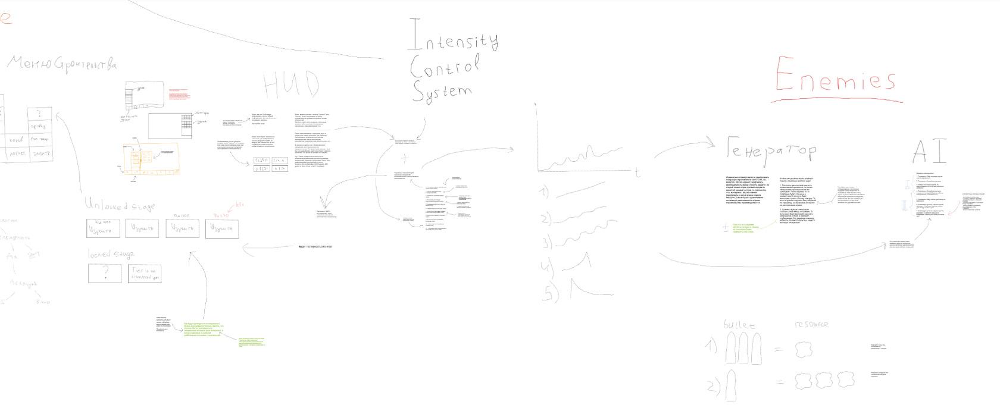
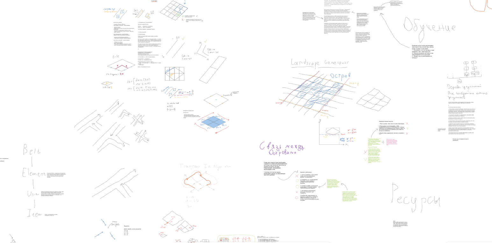

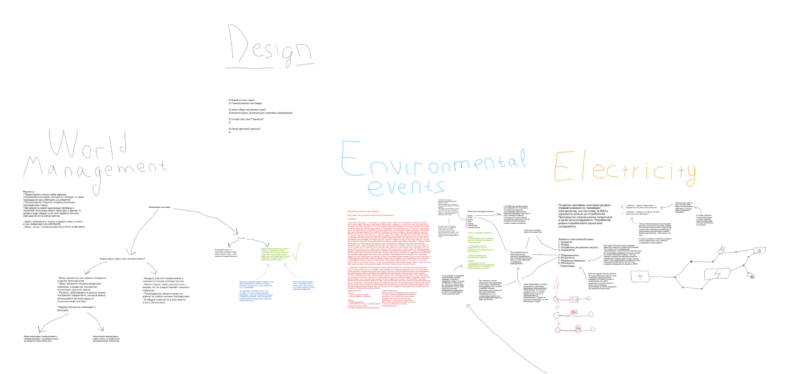
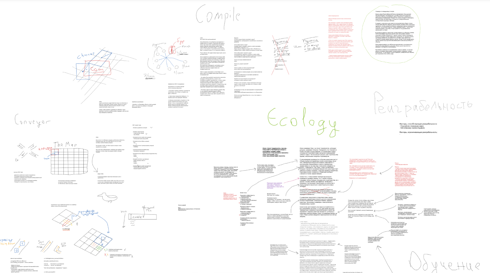

Later this board started lagging, I realized it may not be the best way to organize my thoughts in the first place, and I switched to good-old Google Docs. Most of the design was done in Russian.

---

History snapshots from Discord server:

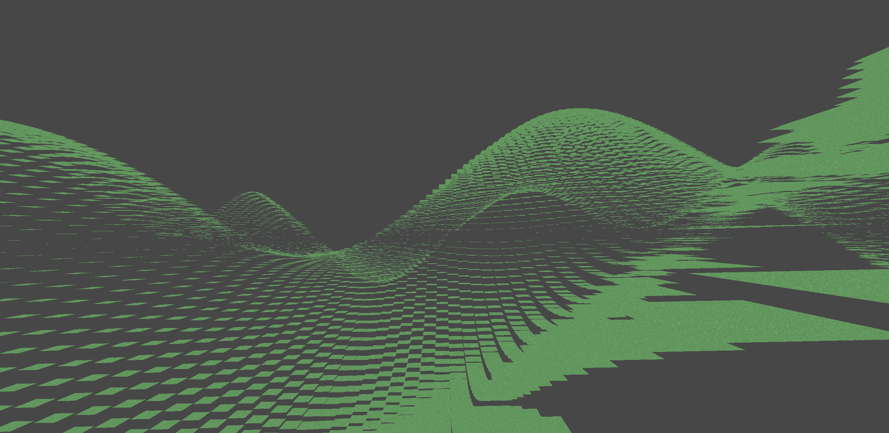
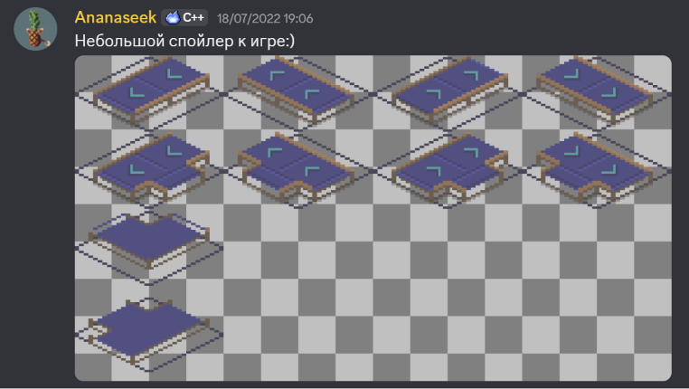