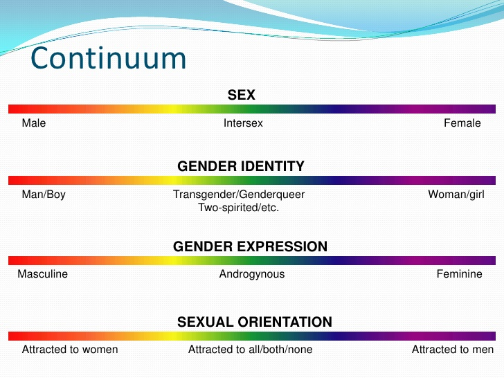

## Intro & disclaimer

I am not going for a rage-bait, asking "how many genders are there?", and instead focus on the questions "what is a gender?" and "how are men and women different?"

Please be patient and open-minded to truly understand the depth of these questions.

For the sake of finity and sanity, I am oversimplifying a lot of things. Also, I am not a sexologist, anthropologist, socilogist, historian or psychologist, so take my words with a grain of salt. I am trying to stay open-minded and self-critical, to not fall for confirmation bias, but I am a human and may not articulate arguments in the best possible way. Think of it as a source of inspiration for further thinking and research.

To note, even I with all my interest in this topic and self-awareness and acceptance, still find it mesmerizing, confusing and surprizing. I am saying it to let you know that you probably won't feel relieved or enlightened by the end of reading, but given some resource for your brain to digest and process over time.

I also don't like being dogmatic or not support any of my arguments or definitions, so all references are at the end of the page with links to them seen all throughout the text.

You can always leave comments below, just don't be an asshole.

## What is sex?

To set grounds, let's differentiate sex and gender.

Sex is the biology. You may be born with male features, with female features, or both, to some extent. Nature is not perfect at managing life so sex is not a purely yes-or-no thing, but a range. In 0.018% to 1.7% of births, a baby cannot be defined as strictly male or female, but as a combination of both (intersex)[^1] [^7]. Sex is defined through a combination of genetic, hormonal, anatomical and reproductive characteristics, which usually - but not always - align[^5], making otherwise obvious anatomically distinct features misleading and confusing.

Biological sex is deeply related to sexual reproduction, as nicely explained by the National Library of Medicine of the USA:
>*Sex is a biological concept. Asexual reproduction (cloning) is routine in microorganisms and some plants, but most vertebrates and all mammals have 2 distinct sexes. Even single-cell organisms have “mating types” to facilitate sexual reproduction. Only cells belonging to different mating types can fuse together to reproduce sexually (2, 3). Sexual reproduction allows for exchange of genetic information and promotes genetic diversity. The classical biological definition of the 2 sexes is that females have ovaries and make larger female gametes (eggs), whereas males have testes and make smaller male gametes (sperm)*[^13]

They also show that biological sex is determined by a set of criteria, not a single definiting feature:
>*However, many people cannot make either eggs or sperm, yet are recognized as female or male based on other physical characteristics; people who do not have either ovaries or testes are rare. For individuals that possess a combination of male- and female-typical characteristics, these clusters of traits are sufficient to classify most individuals as either biologically male or female. For example, a person with testes and a penis, who cannot make sperm, is usually classified as a biological male, as long as the person does not possess female features such as a vagina, ovaries, or uterus. Based on evidence presented, to define male and female individuals in general society, we expand the defining characteristics of sex to include nongonadal traits, as well as classical gonadal traits.*[^13]

To summarize, sex is a range of features (between male and female), it is non-negotiable, cannot be changed or questioned. Once doctors figure out, based on a set of tests, a baby is assigned its sex.

Moving on.

## What is gender?

Gender, on the other hand, is much more vague and subjective. Generally, gender is a set of social, psychological, cultural, and behavioral aspects of "being a man, a woman or portraying a third gender"[^2], as written in wikipedia.

WHO (World Health Organization) tends to describe gender as a purely social construct, moving all biological and otherwise internal properties to the definition of sex. It is possibly more clean way to tell the story than mine, but the idea is roughly the same.

>*Gender refers to socially constructed characteristics of women and men – such as norms, roles and relations of and between groups of women and men[1].  Gender norms, roles and relations vary from society to society and evolve over time.*[^11]

Another explanation by WHO:
>*Gender refers to the characteristics of women, men, girls and boys that are socially constructed.  This includes norms, behaviours and roles associated with being a woman, man, girl or boy, as well as relationships with each other. As a social construct, gender varies from society to society and can change over time.*[^12]

What is gender identity:
>*Gender identity refers to a person’s innate, deeply felt internal and individual experience of gender, which may or may not correspond to the person’s physiology or designated sex at birth.*[^11]

It is however pretty complicated... so let's dive into that.

### Gender as an expression of social role

One of the parts constituting a gender, and by far the most prominent, is an expression of social role. Usually it matches one's sex - in this case a person is cis-gender[^9].

WHO, as already mentioned, chooses to define gender as a purely social construct. Based on gender, not any biological traits, all social categorization, legislation and interaction is based. Here is my explanation for the social role of gender:

Depending on the society, its norms, traditions and believes, genders took different forms. Society bound certain expectations with genders, like clothing, behaviour, employment and freedom. In some societies, men would wear purely practical cheap clothes, in others flamboyant or maybe open clothes. Same principle applied for women: some societies would portray women as subjects of desire and would oversexualize them, and others would make them housekeepers and babysitters. Those gender norms differ spatially (geographically) and temporally (over time) and there is no right way of inventing them.

To demonstrate the temporal dynamics in gender constructs, remember the current view that "pink is female, blue is male". Well, it wasn't always the case. It used to be the other way around - pink was a shade of "masculine" red, and blue was a color of sky and daylight[^14].

### Gender as an internal (psychological) fixture

Gender isn't about what you express yourself as. People do cross-dressing all the time, but only few of them do it from an internal conflict. Leaning toward a certain fashion may or may not be related to gender expression or gender non-comformity.

All people have an internal compass, telling them what group of people they belong to based on sex/gender. Here definitions start to tangle up a little, but until our society completely breaks gender stereotypes, we can handle it.

One of the possible mental tests for it involves (an androgynous version of) you sitting in a room with a group of boys (men) and a group of girls (women). You can mentally choose a scenario, where you are recognized as a girl (woman) and being among them from there on, being socially perceived this way, or as a boy (man). Alternatively, you may feel like you don't belong to any of the groups or both at once.

Internal compass may change over time, it may be something noone else knows about, and it is heavily influenced by biology and environment. Most importantly though, **gender incongruence is not a mental disorder**[^4]. Moreover, if not addressed properly, may lead to gender dysphoria, which can provoke anxiety, depression and other problems[^4].

### Early-childhood gender internalization

Parents teach children gender stereotypes which then may form child's self-perception and internalize believes:

>*Children who are taught that certain traits or activities are appropriate or inappropriate for them to engage because they are a girl or a boy do tend to internalize and be influenced by these teachings in later life. For instance, girls who are informed that boys are innately better at math than they are may report that they dislike math and disclaim their interest in that subject.*[^5]

Sticking with gender stereotypes often transfers to children through childhood pattern-repetition:

>*Children learn vicariously, in part, through their observation and imitation of what they see their primary caregivers doing. They tend to imitate and internalize what they see and then repeat those patterns in their own lives as though they had come up with them independently. Children raised watching their parents adhering to strict gender-stereotyped roles are, in general, more likely to take on those roles themselves as adults than are peers whose parents provided less stereotyped, more androgynous models for behaving.*[^5]

### Gender as a biological trait

Biological causes for gender identity are still in research[^6], but evidence suggests that various biological factors play a big role in determining gender identity. There is no consensus on the way to predict or understand the specifics of this process. Genetics, brain development, psychological development and hormones have been evidenced to contribute to shaping gender identity.

There may be differences in hormonal levels and other biological features of a child that are more typical for the opposite-sex peers, and they often tend to behave as such and socialize with them, rather with the same-sex peers[^5].

Since sex is determined by genetically, some girls may have male genitalia, for example, but they would still be identified as girls based on their chromosomes, hormones and brain development. They would commonly show all social signs of being a girl:
>*It is often not till puberty is delayed that investigations reveal that the person is genetically male although with female external genitalia and gender identity, as neither have been masculinized during early development*[^6].

---

To summarize, gender is a complex set of social, psychological and biological traits. It is an actively researched topic.
Gender dysphoria and gender incongruence are no longer seen as medical disorders. Gender is not a male/female flag: it can be seen as a femininity-masculinity continuum[^8] or, with appearance of third and more genders, a plane or a different higher-dimensional space.

[Source of image](https://scalar.usc.edu/works/index-2/media/the-gender-spectrum)

### Gender is not sexual orientation

To clear up some confusion: gender and sexual orientation live on different axis. Transgender may be heterosexual, just like cisgender may be homosexual: any combination is possible[^10].

## Genders nowadays

Partially through advances in psychology, increased automation and largerly eliminated physical labor, and social growth, nowadays the contrast between gender roles have softened and gender expression is becoming more unisex.

Gender incongruence and gender dysphoria are now treated seriously, with gender-affirming care procedures seen as medical necessity rather than purely cosmetical:

>*With regards to individuals identifying as transsexual, this may be explained at least partly by a divergence between their anatomical gender assigned at birth and their CNS (Central Nervous System) having developed along a different pathway. Thus, one’s own personal experience of gender may not always correlate with the assigned anatomical sex. However, it must be emphasized that no gender identity is ever of less value than another, but in many instances, problems have arisen because society does or cannot understand the situation. In the UK the Equality Act of 2010, relating to England and Wales, states that you must not be discriminated against because you are transsexual, when your gender identity is different from the gender assigned to you when you were born. Under the Act, to be prevented from gender reassignment discrimination, it is not necessary to have undergone any specific treatment or surgery to alter your sex applied at birth to that of your preferred gender.*[^6]

## The man in a skirt example

There still are social norms and expectations regarding men and women. But now, the reasons are different. If you see a man in a casual dress or a beautiful midi skirt and a top, gracefully walking through the streets, what would you think? Okay, apart from weird stuff, really. He probably lives a peaceful life. He clearly wants some color in his life, in clothing, and maybe other things. And he is indefinitely brave for being himself.

Now get back to the first instinct? It felt weird to even imagine that, didn't it? If it didn't, I am proud and jealous, genuinely. And happy.

Most people would at least find it exciting and unsettling to imagine a full grown adult man, with beard and glasses, for some reason dressed like a woman. Isn't that disturbing?

And yet...

nothing bad happened, right?

He is living a seemigly normal life, not being a freak and clearly not just playing it. He doesn't seem to care. If the face was a bit different, with a narrower jaw and no beard, maybe longer hair, and arms and legs were less hairy and muscular, nothing, literally nothing would bother a viewer anymore. It would just be a beautiful, stylish, and possibly desired woman.

## The boy and mom example

We are built to notice differences. In everything. In nature, in surroundings, in ourselves, and in others. As both biological and social creatures, we have to constantly evaluate the world around us. Is that a safe place to go? Does this food smell or taste bad? Does this person seem safe to be around, or maybe too risky and potentially unreliable?

Since our early childhood, we always manifest our parents' views on the world. If they scream after they spill coffee on their shirt, we learn to do the same. If they freak at seeing a weirdo, we do the same. Interestingly, a young boy could easily, out of pure curiousity, ask his mom "Can I also wear a skirt?" Some mom would actually buy him a skirt and let him be, until the majority of his boy friends will show him that noone does this. Or until an adult at school or at a playground would make a notice of this irregular style. Another mom would likely just tell him that he is a boy and cannot wear a skirt (which would only spike more questions!) or wiggle away from it to avoid it altogether.

## Opt out of risks strategy

As can be seen already, it's not an attempt to blame moms. They are doing their best at assessing risks for the child, and most of the time allowing their boy to wear a skirt will result in something that could be seen as dangerous - for her, or for him, or both. She would just opt for the safer option, naturally.

### Other forms of social risk

This is actually more universal and doesn't just go for unisex fashion or anything in particular. Sexism, racism, agism and any kind of discrimination works the same way. Someone who stands out of the group will be seen as different. Some groups wouldn't see it as a problem, would accept and support diversity, and some groups would see it as dangerous, weird or unacceptable.

A boy in a skirt is definitely something that stands out in a lot of places.

Only through more critical thinking and more sophisticated upbringing and educational programs we can achieve society-wide changes to perception and tolerance.

### Shock is natural and harmless

Reality can be far from what our ever-evaluating brains imagine. Guys in skirts are rare, but they aren't feared of. They are just... unusual. Like I said with the man-in-a-skirt example, I would also be surprised and a bit shocked to see a man casually walking in a dress or skirt. Just because I barely have seen anything like that. And this is another important takeaway from this rant. Many people are okay with it, they shouldn't be seen as antisocial discriminatory monsters. After all, discriminating is now being discriminated, paradoxially. If someone laughs over a guy in a skirt, most would feel disgust of the bully, not the guy in a skirt.

### Stompted fears translate outside

Another interesting thought is the hatred to those who were allowed more. That boy from the second little story, when he grew up, he has this thought in the back of his mind, sharply stomped. "Men cannot wear skirt. Skirt dangerous." And then he sees a guy doing just that. And his mind spins off. "He is safe? I had to abandon my dream, and he is just walking around like this?" An obvious solution would be "Well, if he is safe, then you will be safe too, and you can just fulfill your dream and live happily". But that boy, now man, has flashes of terror from his childhood. Maybe it wasn't even that bad, just a teacher making a public notice about it and asking his mom to school. Nothing crazy, right? A social awkwardness, a barrel of shame and fear, that's what he got. Mom was right, after all. It was dangerous. So the only option to satisfy the jealosy is to bring the same fear to the other guy by ashaming him.

## Back to the gender question

I am glad to discuss this whole problem from many different angles, but I should be getting back to the question raised in the beginning. "How are men and women different?"

### Sex/gender features we think of

It's laughably simple until it's not. Let's ponder.

Sex-wise, most people would notice common obvious features. Genitals, breasts, fat-distribution, height, weight, build/shape, face, voice, body and facial hair. As explained in the "What is sex?" part, sex is determined genetically and may contradict with anatomy, but we are talking about features obvious to an external viewer.

More gender-wise, many would mention hair/nail length, clothes, jewelry, make up, skin, walk, gestures, behaviour, social roles and ways to fit into society.

### Gender feature differences are blending together

Nowadays those features are blending more and more. Men wear longer hair, some even dye it, whereas women wear short; men shave, care about their nails and skin, some even paint their nails and/or grow them long, women do as well. Fashion is getting more and more unisex clothes.

What does now make a man - a man, and a woman - a woman? Not genitals and chromosomes, right? It doesn't matter to anyone where the center of mass of a person is and whether they have some features of a female or of a male. Why care? You don't talk to a bunch of biological features. The person in front of you isn't entirely determined by the chromosomes and genes. They have their own life, experiences and thoughts.

Most of these features are interchangable and can be (to some degree) articulated by both genders (it also depends on specific person). Gender expression may correlate but doesn't depend on sexual orientation, gender identity and sex. A perfectly cis-gender man may express himself in traditionally feminine ways (keep in mind that gender expression is a continuum and is partly subjective and dependent on culture). And there are no reasons to not let him. Unless crossing other borders, picking clothes from a different rack and mingling his fashion is completely harmless.

### Homosexual relationships bend genders further

Romantic and sexual attractions shed more light onto the problem. Especially well seen with different sexualities: how do people know what gender they are attracted to? Based on the vibes, emotions, connections, experiences, expectations, desires, and, undoubtedly, media and social depictions. Desiring a man is usually associated with being the small, weak and vulnerable one, while desiring a woman is being the dominant, strong and caring. I think this could work in heterosexual relationships, but definitely not in homosexual. There those roles are more like *guidelines* or *rules of thumb* than real expectations. And even then, one can be the "weak" one and another can be the "strong". Or both can be one or the other. Or they can be fluid in this matter, changing back and forth.

The feeling of attraction to a gender is a weird thing on its own, since you can't date or love a *gender*. People always interact with people, not with abstract groups or categories. Saying that one is attracted to men or women is a shortcut to saying that on average, one would prefer a person from one group than from another. While attraction is believed to have some biological grounds, it is also heavily shaped by experiences, stereotypes and typical gender expressions.

## Conclusion

Genders are weird and they don't have to be bound to sex anymore. We now know that it can happen that a person is genuinely discontent with their assigned sex, and they can be helped to overcome or prevent the potential distress from it by accepting and treating them.

Gender identity can be supressed due to stigma, fear or lack of support. As believed by modern science **gender identity is not a choice**. Gender incongruence or dysphoria can be determined by doctors. If you believe you or your child may experience that, seek **professional medical help** because **potential problems from suppressing it may be much more difficult to deal with**.

And also don't expect everyone to understand it or accept that you are different (if you think you are). Everyone needs their time.

Thank you for reading, have a great day!

Cover image taken from [Wikipedia](https://en.wikipedia.org/wiki/Gender). All text is written by me (AnanaSeek4Jam) unless explicitly cited. AI was carefully used for research purposes only.

[^1]: https://en.wikipedia.org/wiki/Intersex
[^2]: https://en.wikipedia.org/wiki/Gender
[^3]: https://en.wikipedia.org/wiki/Androgyny
[^4]: https://en.wikipedia.org/wiki/Gender_dysphoria
[^5]: https://www.mentalhealth.com/library/factors-influencing-gender-identity
[^6]: https://biomedgrid.com/fulltext/volume10/more-questions-than-answers-factors-affecting-human-gender-identity-and-sexual-orientation-a-mini-review.001542.php
[^7]: https://en.wikipedia.org/wiki/Gender_identity
[^8]: https://lgbtqia.fandom.com/wiki/Gender_spectrum
[^9]: https://en.wikipedia.org/wiki/Cisgender
[^10]: https://lgbtqia.fandom.com/wiki/Sexual_orientation
[^11]: www.who.int/news-room/questions-and-answers/item/gender-and-health
[^12]: https://www.who.int/health-topics/gender
[^13]: https://pmc.ncbi.nlm.nih.gov/articles/PMC8348944
[^14]: https://www.rd.com/article/pink-for-boys/