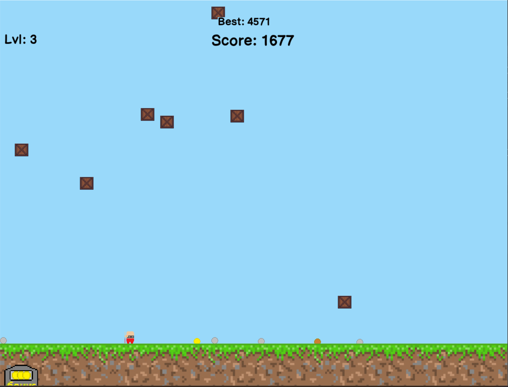

###

As a school project, I developed Lolly Jump, a mobile game on Unity. You can download it or play it in your browser on the [Itch.io](https://ananasikdeveloper.itch.io/lolly-jump) page.

Historically, this is one of my first projects on Unity, started on *November 4, 2020*. Over the course of several years, I returned to it from time to time and updated it, which you can explore in more detail on [GitHub](https://github.com/AnanasikDev/LollyJump) — all the code is open source.

## Earliest stages: Python

While clearing my PC and trying to find something interesting to post here, I stumbled across a very interesting artifact, called `LollyJump6.2Test.py`. Version control was minimalistic at that time for me, but what made me even more curious was the fact that I wrote that in Python! Apparently, unbeknownst to me, the history of Lolly Jump dated way back to *May 2020*.

[Artifact](/blog/posts/lolly_jump/LollyJump6.2Test.py) as it was found.

</img>
