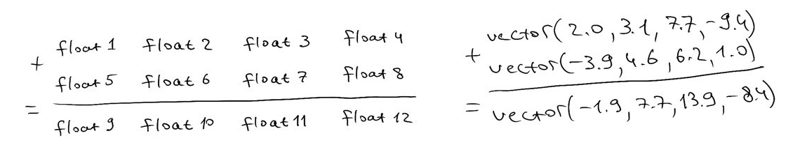
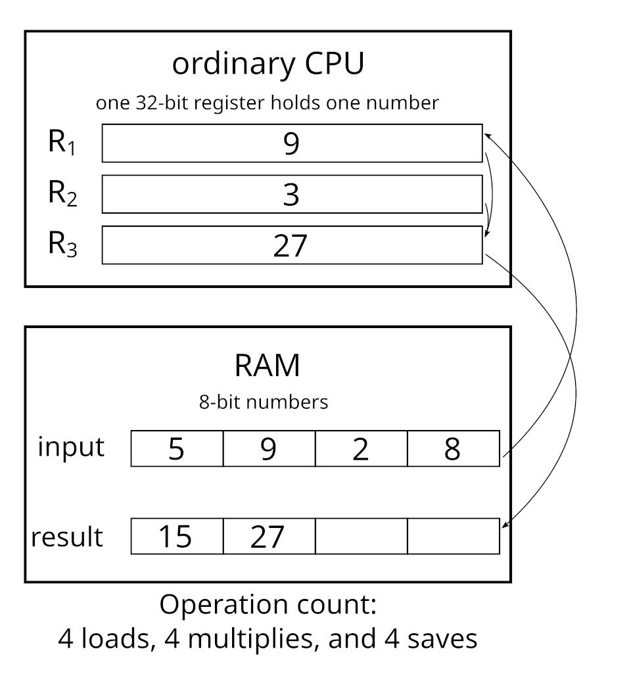
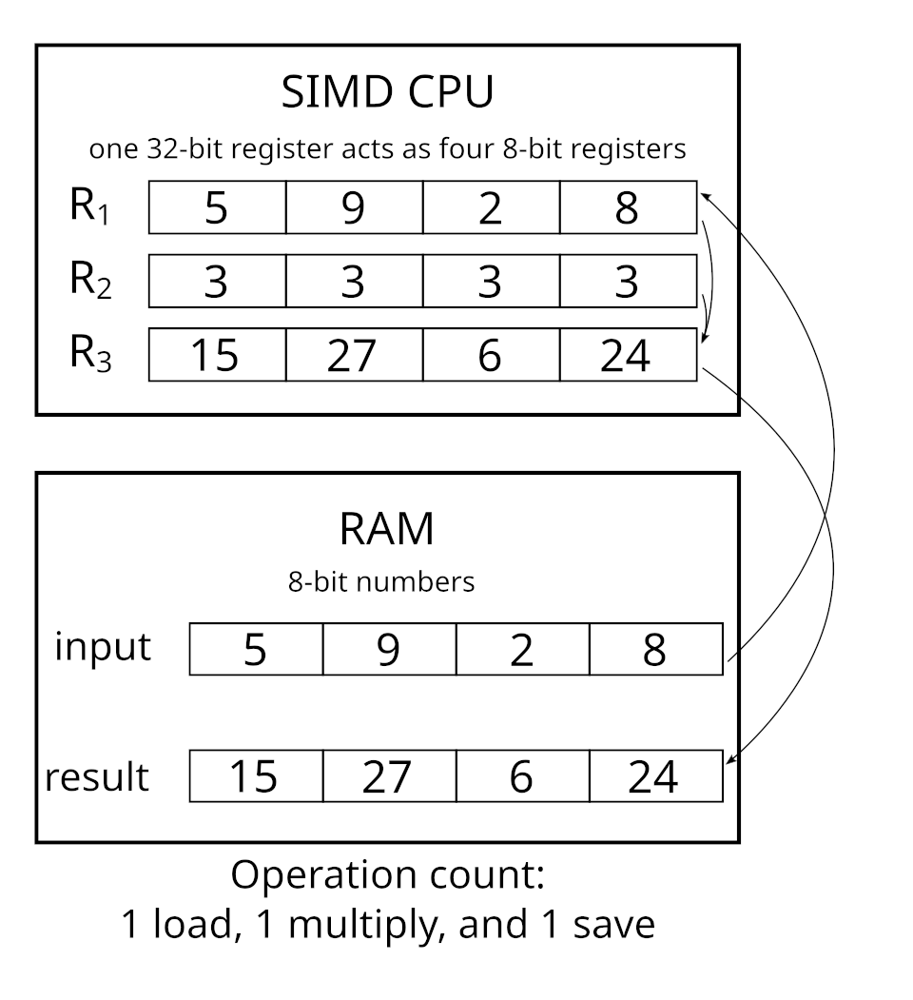

**>Part 1: Introduction, how to read SIMD<**\
*Part 2: Basic use, maths, speed up graphics*\
*Part 3: Benchmarking, pushing to the limits*\
*Part 4: Assembly x86, fun instructions*\
*Part 5: History, compatibility, availability*

## Problem

Imagine a situation where we need to operate on large amounts of data using very trivial operations, for example, for each pixel on the screen, we take an illumination value and multiply that by the albedo value.


Repeat that for every pixel and you get 2 million multiplications, performed one by one in a row. Another example: we work with matrices and we need to sum or multiply them together. The product of 2 4x4 matrices, most common in 3D applications, takes 64 multiplications and 48 additions. That's a lot!


## What should we do?

We could go several paths:
1. **Make each operation cheaper** (texture mipmaps, approximate with lower precision, etc, + other approaches also apply)
2. **Don't do what's not needed** (don't render what you cannot see, don't load resources that are not needed right now)
3. **Reuse previous calculations** (cache, precalculate)
4. **Fake it** (LOD, lookup tables, limit approximation, upscaling)
5. **Perform multiple operations at the same time** (GPU, multithreading, decentralizing, SIMD)

Engineers knew about the helplessness of CPUs in the field of 3D graphics. One matrix multiplication is pretty expensive alone, and for believable scenes you need to calculate thousands and millions of them per frame.

## What is SIMD?

SIMD stands for `Single Instruction Multiple Data`[^1]. It is a hardware mechanism that allows processors to perform the same instruction (addition, multiplication, load, store, reciprocal, etc) not one at a time, but 4, 8, or even 16 in parallel, depending on the CPU architecture and supported features. This way at the cost of one multiplication, you can perform a whopping 16 multiplications on modern CPUs or 8 on more-or-less average ones.






Images are taken from [Wikipedia](https://en.wikipedia.org/wiki/Single_instruction,_multiple_data).


## Terminology

SSE (`Streaming SIMD Extensions`) is a very common [Intel](https://en.wikipedia.org/wiki/Intel) instruction set extension to the [x86 architecture](https://en.wikipedia.org/wiki/X86), which operates on 128-bit (16 byte) registers[^2].

AVX (`Advanced Vector Extensions`) expanded SIMD capabilities by introducing 256-bit registers. It also introduced a new three-operand instruction format, improving compiler optimization and reducing unnecessary data movement[^3].

AVX-512 is the latest major extension introducing 512-bit registers. It is pretty rare and is mostly available on high-end desktop and server CPUs due to high power consumption and thermal demands[^4].

XMM - 128-bit CPU registers[^2]\
YMM - 256-bit CPU registers[^3]\
ZMM - 512-bit CPU registers[^4]

3DNow![^12] is an [AMD](https://en.wikipedia.org/wiki/AMD) x86 instructionn set extension for SIMD, which was deprecated in 2010.

### Naming convention

In C++ SSE 128-bit operations have `_mm` prefix\
AVX 256-bit ones have `_mm256` prefix\
AVX-512 uses `_mm512` prefix.

```
_mm256_add_ps
   ↑
AVX prefix
```

Separated with underscore using snake_case, next comes the operation:

```
_mm256_add_ps
        ↑
    add operation
```

Commonly you will see these: add, sub, mul, div, load, store, set, cmp (compare), sqrt (square root)

Next comes data type and layout:

```
_mm256_add_ps
            ↑
   packed single layout
```

Here is how to read it:

| suffix |              meaning                       |
|:------:|--------------------------------------------|
|ps      |**p**acked **s**ingle-precision floats      |
|pd      |**p**acked **d**ouble-precision floats      |
|epi32   |**e**xtended **p**acked 32-bit **i**ntegers |
|ss	     |**s**calar **s**ingle float                 |
|sd	     |**s**calar **d**ouble                       |

SIMD commonly support integer operations on top of float ones. `epi32` is broken down into `epi` (`extended packed integer`) and 32 which means 32-bit integer.

Scalars here are opposed to packed values: scalar operations work with just one number while packed ones work on the entire group in parallel[^14].

Another very common suffix is `u` and it stands for *unaligned* memory access[^13]:
```cpp
_mm_load_ps   // aligned
_mm_loadu_ps  // unaligned
```

For optimal performance, data is commonly aligned to 16 or 32 bytes[^13] and then the aligned version of memory-access operations are used.

## Instruction examples

Take a look at these:[^4]
```cpp
__m128 a = _mm_set1_ps(3.14f);    // set all 8 floats to 3.14, aka broadcast it over all lanes
__m128 b = _mm_set_ps(1.0f, 2.0f, 3.0f, 4.0f);// set all 8 floats to 3.14, aka broadcast it over all lanes
__m128 c = _mm_div_ps( a, b );   // component-wise division
__m128 d = _mm_sqrt_ps( a );    // four square roots
__m128 e = _mm_rcp_ps( b );     // four reciprocals
__m128 f = _mm_rsqrt_ps( a );   // four reciprocal square roots (!)
__m128 minv = _mm_min_ps( e, f );
__m128 maxv = _mm_max_ps( c, e );
```

Some functions of the Vec8f abstraction layer for 256-bit SIMD intrinsics by Agner Fog[^9] from the [Vector Class: Version 2 project](https://github.com/vectorclass/version2/blob/master/vectorf256.h):
```cpp
// vector operator + : add element by element
static inline Vec8f operator + (Vec8f const a, Vec8f const b) {
    return _mm256_add_ps(a, b);
}

// vector operator - : subtract element by element
static inline Vec8f operator - (Vec8f const a, Vec8f const b) {
    return _mm256_sub_ps(a, b);
}

// vector operator - : unary minus
// Change sign bit, even for 0, INF and NAN
static inline Vec8f operator - (Vec8f const a) {
    return _mm256_xor_ps(a, Vec8f(-0.0f));
}

// vector operator * : multiply element by element
static inline Vec8f operator * (Vec8f const a, Vec8f const b) {
    return _mm256_mul_ps(a, b);
}

// Member function extract a single element from vector
float extract(int index) const {
#if INSTRSET >= 10
    __m256 x = _mm256_maskz_compress_ps(__mmask8(1u << index), ymm);
    return _mm256_cvtss_f32(x);
#else
    float x[8];
    store(x);
    return x[index & 7];
#endif
}
// Extract a single element. Use store function if extracting more than one element.
// Operator [] can only read an element, not write.
float operator [] (int index) const {
    return extract(index);
}
```

Intel intrinsics guide[^6] has a full list of SIMD instructions, do take a look.

## How to not use SIMD

For my latest project, a [C++ ray tracer](https://github.com/AnanasikDev/Raytracer) I worked on denoising and when I saw it dropping my performance 10 times, my interest for SIMD and the need for it finally matched.

It was my first time really using SIMD, and I did it wrong, here is how:

For the G-Buffer (all data I collect each frame - albedo, light, normals, distances, etc) I have the so-called *Array Of Structures*, or AoS[^16]. This is the simplest and most naive approach, which makes my data layout linear:
```
x y z x y z x y z
```

And then I load an AoS to the SIMD registers:

```c
__m256 tNX = _mm256_set_ps(normBuf.AtRaw(7).x, normBuf.AtRaw(6).x, normBuf.AtRaw(5).x, normBuf.AtRaw(4).x, normBuf.AtRaw(3).x, normBuf.AtRaw(2).x, normBuf.AtRaw(1).x, normBuf.AtRaw(0).x);
__m256 tNY = _mm256_set_ps(normBuf.AtRaw(7).y, normBuf.AtRaw(6).y, normBuf.AtRaw(5).y, normBuf.AtRaw(4).y, normBuf.AtRaw(3).y, normBuf.AtRaw(2).y, normBuf.AtRaw(1).y, normBuf.AtRaw(0).y);
__m256 tNZ = _mm256_set_ps(normBuf.AtRaw(7).z, normBuf.AtRaw(6).z, normBuf.AtRaw(5).z, normBuf.AtRaw(4).z, normBuf.AtRaw(3).z, normBuf.AtRaw(2).z, normBuf.AtRaw(1).z, normBuf.AtRaw(0).z);
```

Which is not only ugly, but is also slow and loses the power of SIMD.

First issue is no data locality[^15]: when the order of memory access is linear and consequent, then processor cache prefetches make most memory reads almost free, but when it is accessed in a random or reverse order, the efficiency drops dramatically.

Second issue is less obvious and has to do with AoS. Apparently, there is an alternative: an SoA or *Structure of Arrays*[^16]. In such case the normals would be stored like this:

```
X = x x x
Y = y y y
Z = z z z
```

You might already see the advantages of this: when CPU loads first value of x into the `tNX` 256-bit register, it prefetches many more adjacent values of x. At the cost of just one memory access (all others are then retrieved from cache) we manage to populate the entire SIMD register.

With all these issues I made when working with SIMD as a newcomer, it *technically* did improve performance, but only a little bit, so little, it didn't really matter. SIMD are very promising though, and as any other tools, have to be used correctly. Follow me through my journey, which I will document in the upcoming articles.

## Look into

- Since C++ 26 standard SIMD features are becoming more accessible and easier to use without the need to use intrinsics[^8]
- Newer and more expensive CPUs support up to AVX-512 which is (more than) twice as powerful as AVX
- Many math libraries in many languages have SIMD backend to speedup calculations, such as .NET System.Numerics[^17] and GLM[^18]
- If you want to benchmark SIMD (or anything else) DO NOT do it manually and rely on a microbenchmarking library, like [the one by google](https://github.com/google/benchmark).
- [Vulkan Guide Intro to SIMD](https://vkguide.dev/docs/extra-chapter/intro_to_simd/)

## Sources

All text is written by me; sources, examples and code are referenced inline or at the end of this article. Images are always credited unless I am the author of them.

Code on the cover image is used solely for artistic purposes and is taken from [Stackoverflow](https://stackoverflow.com/questions/1389712/getting-started-with-intel-x86-sse-simd-instructions).

[^1]: [Wikipedia: SIMD](https://en.wikipedia.org/wiki/Single_instruction,_multiple_data)
[^2]: [Wikipedia: SSE](https://en.wikipedia.org/wiki/Streaming_SIMD_Extensions)
[^3]: [Wikipedia: AVX](https://en.wikipedia.org/wiki/Advanced_Vector_Extensions)
[^4]: [Wikipedia: AVX-512](https://en.wikipedia.org/wiki/AVX-512)
[^5]: [Algorithmica](https://en.algorithmica.org/hpc/simd/intrinsics/)
[^6]: [Intel Intrinsics Guide](https://www.intel.com/content/www/us/en/docs/intrinsics-guide/index.html)
[^7]: [Jacco Bikker's blog](https://jacco.ompf2.com/2020/05/12/opt3simd-part-1-of-2/)
[^8]: [Dennis Andersson's blog](https://dennisrants.substack.com/p/how-to-simd-programming)
[^9]: [Megtaza](https://megtaza.com/)
[^10]: [Cppreference: SIMD](https://en.cppreference.com/w/cpp/experimental/simd.html)
[^11]: [Vector Class project](https://github.com/vectorclass)
[^12]: [Wikipedia 3DNow!](https://en.wikipedia.org/wiki/3DNow!)
[^13]: [Interactive OpenMP Programming: SIMD](https://passlab.github.io/InteractiveOpenMPProgramming/SIMDandVectorArchitecture/5_DataAlignmentandLinearClauses.html)
[^14]: [Stackoverflow: packed vs scalar](https://stackoverflow.com/questions/16218665/simd-and-difference-between-packed-and-scalar-double-precision)
[^15]: [Wikipedia: data locality](https://en.wikipedia.org/wiki/Locality_of_reference)
[^16]: [Wikipedia: AoS and SoA](https://en.wikipedia.org/wiki/AoS_and_SoA)
[^17]: [Microsoft: SIMD in .NET](https://learn.microsoft.com/en-us/dotnet/standard/simd)
[^18]: [Stackexchange: SIMD in GLM](https://gamedev.stackexchange.com/questions/132549/how-to-use-glm-simd-using-glm-version-0-9-8-2)