The Swap: Engage was my first ever big project, dating from 2021-01-02 to 2022-01-23, just a bit more than a year. It was an amazing experience for me. I was documenting my progress in monthly devlog videos, created a discord community around the game, noted comments on the progress and players' thoughts, and implemented some of them for the next video. As for a 13-year-old me back then, it was insanely powerful. Of course I learned a lot of C#, math, game programming and learned basics of Unity.

Here is history of the project, from beginning to the current state.

## First thoughts, Python. Dread Forest

It was year 2019. I got inspired by some Minecraft RPG minigames, I thought that's my genre: long vertical progression, limited but fun exploration, dynamics, captivating graphics. This was my first time I had thought to myself that it could be ME who made a game like that. I started studying programming. I got into Scratch classes, being in middle school, that was perfect for me. Passion grew stronger, and soon enough I realized that's not enough anymore. I abandoned my flappy bird project and started learning Python. A real, powerful programming language, with functions, OOP and all the smart stuff. I was mesmerized, and with abusing internet, with some hints from my dad, I learned it to a decent level by July 2020. I was using pygame at the time, made my first graphical applications, games and simulations. My passion was burning live, I knew there is no going back. It was amazing.

So, Dread Forest was born.

I was first exposed to designing algorithms and 

<details>
<summary>
Python code snippet I found
</summary>

I think it was a "game development library" I made in May-June 2020.

```python
class Obj:  # Player/mob class
    def __init__(self, x, y, width, height, image_file, back_color=[255, 255, 255], colorkey=[255, 255, 255],
                 sight_speed=0, up_speed=0, jump_speed=0, jump_speed_memory=0, up_plank=0, down_plank=0, speed_update=0,
                 img_num=None, matrix_x=0, matrix_y=0, mx=0, my=0):  # color_key=[255,255,255]
        self.x = x  # cords
        self.y = y  # cords
        self.image_file = image_file  # name of image
        self.sight_speed = sight_speed  # speed to go to right/left
        self.up_speed = up_speed  # to move up/down
        self.width = width
        self.height = height
        self.jump_speed = jump_speed  # jump speed
        self.jump_speed_memory = jump_speed_memory  # obj's jump_speed written in memory
        self.up_plank = up_plank  # height of jump
        self.down_plank = down_plank  # the lowest point of obj's y
        self.speed_update = speed_update  # changing of obj speed in process
        self.back_color = back_color  # color uses to fill field near the obj
        self.colorkey = colorkey  # color uses to ignor for moveing obj
        self.img_num = img_num  # uses to fastly changing os skins :D
        self.matrix_x = matrix_x
        self.matrix_y = matrix_y
        self.mx = mx
        self.my = my
        self.image = pygame.image.load(self.image_file).convert()
        self.image.set_colorkey(self.colorkey)
        # pygame.transform.scale(self.image,[self.width, self.height])

    def update(self):  # Flip screen to another page
        pygame.display.flip()

    def draw(self):  # Draw obj on screen
        screen.blit(self.image, [self.x, self.y])

    # ----Refilling functions----
    # for fill _color_ near obj  (Also all there funcs are costructions you may use to eraser field you need)

    def rub_circle(self, x=0, y=0, radius=0,
                   edge=0):  # Use it to refill screen around obj (often uses for circle objects)
        radius = self.width
        pygame.draw.circle(screen, self.back_color,
                           [round(self.x + (self.width // 2)) + x, round(self.y + (self.height // 2)) + y], radius,
                           edge)

    def rub_rect_sight(self, x_up=0, y_up=0, wid_up=0, hei_up=0, edge=0):
        if self.sight_speed == abs(self.sight_speed):
            pygame.draw.rect(screen, self.back_color,
                             [self.x - abs(self.sight_speed) + x_up, self.y, 3 + abs(self.sight_speed) + wid_up,
                              self.height + hei_up], edge)
        elif self.sight_speed != abs(self.sight_speed):
            pygame.draw.rect(screen, self.back_color,
                             [self.x + self.width, self.y, 3 + abs(self.sight_speed), self.height], edge)

    def rub_rect_up(self, x_up=0, y_up=0, wid_up=0, hei_up=0,
                    edge=0):  # You can change size or cords of obj's rubber just for that
        if self.jump_speed != abs(self.jump_speed):
            pygame.draw.rect(screen, self.back_color,
                             [self.x + x_up, self.y - (self.height - y_up), self.width + wid_up, self.height + hei_up],
                             edge)
        elif self.jump_speed == abs(self.jump_speed):
            pygame.draw.rect(screen, self.back_color,
                             [self.x + x_up, self.y + (self.height + hei_up), self.width + wid_up,
                              self.height + hei_up], edge)

    def rub(self, x_up=0, y_up=0, wid_up=0, hei_up=0, edge=0):  # The simpliest constructor of rubber funcs
        pygame.draw.rect(screen, self.back_color,
                         [self.x + x_up, self.y + y_up, self.width + wid_up, self.height + hei_up], edge)

    # ----Moving functions----

    def jump(self):  # quite real jump
        self.y -= self.jump_speed
        self.jump_speed -= self.speed_update

    def simple_jump(self):  # jump without phisics
        pass

    def spontan_move(self, x_move, y_move):  # Move x and y as far as you need
        self.x += x_move
        self.y += y_move

    def bounce(self, ceil=True, floor=True, wall_left=True, wall_right=True, hei_up=0,
               wid_up=0):  # Ceil,floor - True/False (If you need to bounce from ceil/floor), wall_ left/right - True/False (If you need to bounce from walls)
        if ceil:
            if self.y <= 0:
                self.up_speed = -self.up_speed
        if floor:
            if self.y >= screen_height - hei_up:
                self.up_speed = - self.up_speed
        if wall_left:
            if self.x <= 0:
                self.sight_speed = -self.sight_speed
        if wall_right:
            if self.x >= screen_width - wid_up:
                self.sight_speed = -self.sight_speed

    def spawn(self, randomize_x=False, randomize_y=False, x=0, y=0, min_x=0, max_x=0, min_y=0,
              max_y=0):  # To respawn mobs in random/noted places you need
        if randomize_x:
            self.x = random.randint(min_x, max_x)  # Don't forget to note min_ and max_ x to use it)
        else:
            self.x = x
        if randomize_y:
            self.y = random.randint(min_y,
                                    max_y)  # Pleeease, don't forget to note min_ and max_ y to use it!!) I'm not kidding you!
        else:
            self.y = y
```

</details>


## Unity Era. The Swap: Engage.

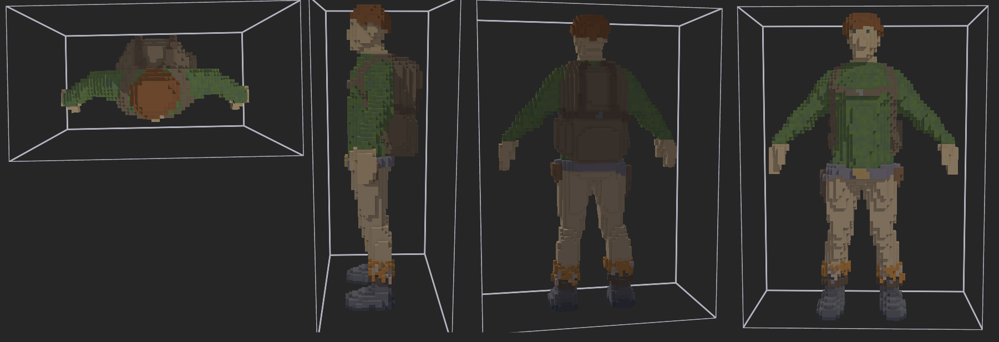

I began working on MVP on January 2nd, 2021. By 11th, I made the first playable and showable version and published my [first YouTube video](https://youtu.be/TTxDh-AFe1Y?si=VyRXFjUwCDNPQXNq).

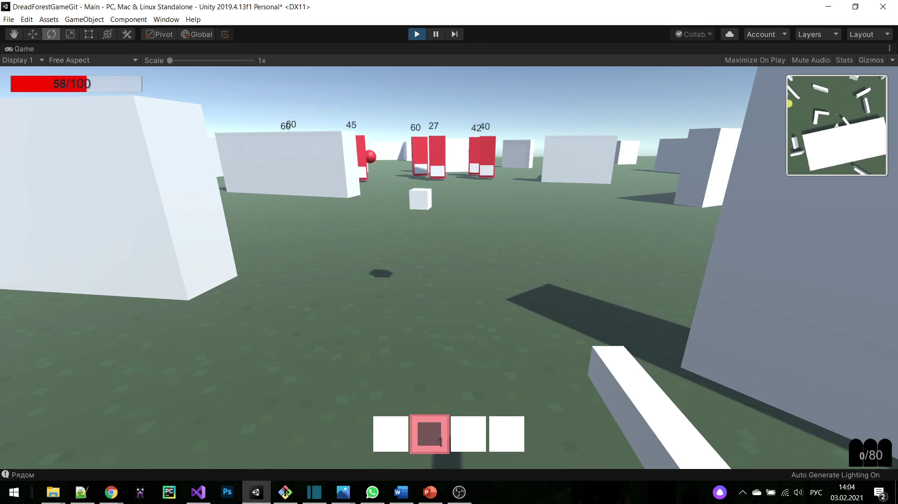
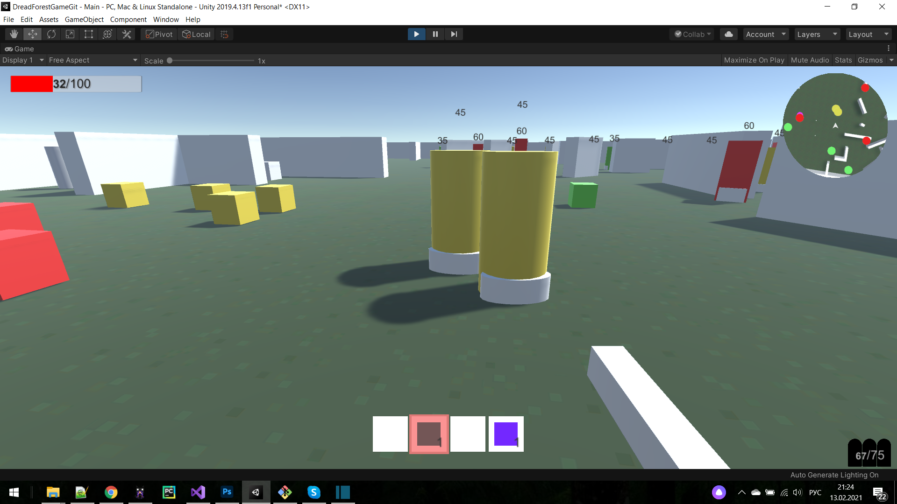

Initially the idea was to stay close to the Dread Forest idea and make it constrained to 2D gameplay - no jumping, no hills, no vertical camera tilting.

Later, after reading others' thoughts and having thought about the future of the game, I reconsidered it and made it "fully 3D". For that I spent a good amount of time working on a semi-custom first-person character controller. I think I wanted to make it third person but quickly realized I better be cutting it to first-person.

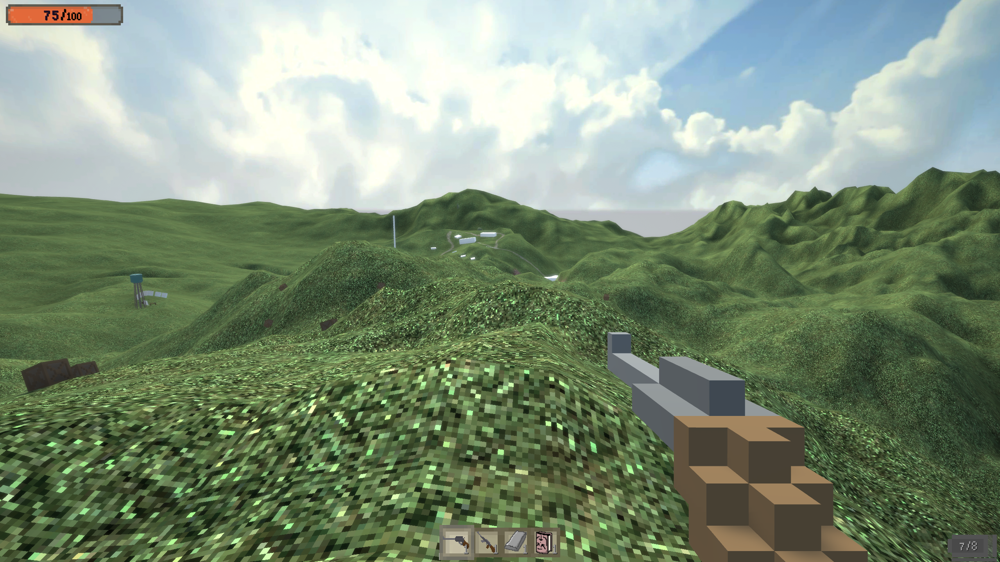

Credits:

A lot of help came from my community. A lot of 2D sprites and 3D models were created by a couple of dedicated and passionate people - **Staby** (Stabidy), **Dion1is1sus**, **Pixel_** (*Pixel Studio*), **Blenderkon**. Music was composed by **Dominik Giesriegl** and sound design by **EF.Sound**, both exceptionally talented, skillfull, dedicated and sincere. Was a pleasure working with them.

Community was organized thanks to my moderator and friend **Komb1st** (*Swift*), as well as by active member **DJL** (*DJLETOFF*).

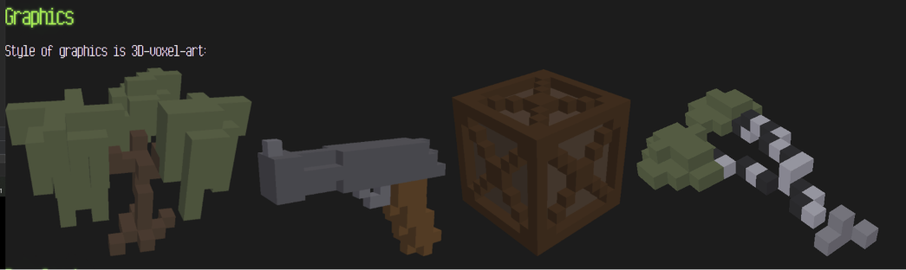
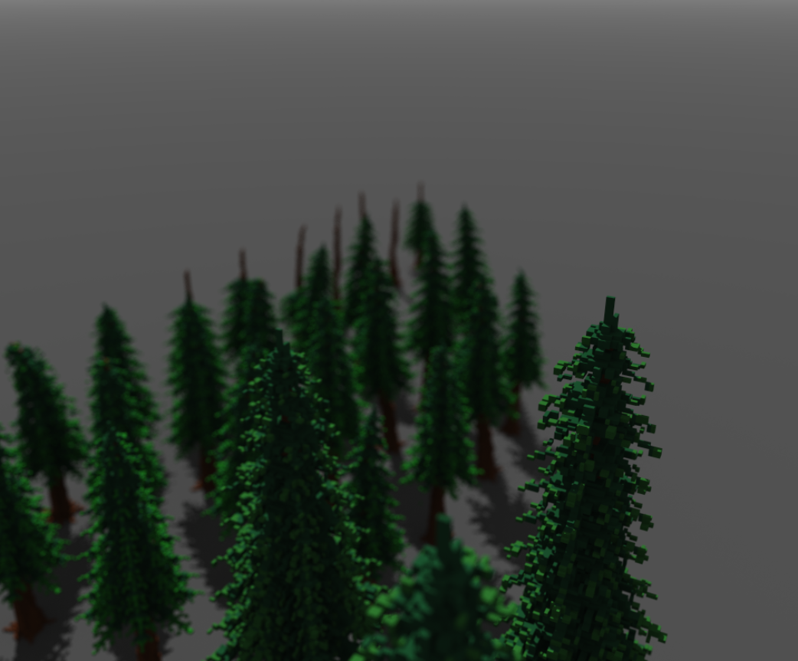
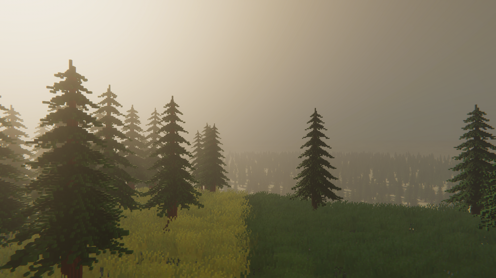

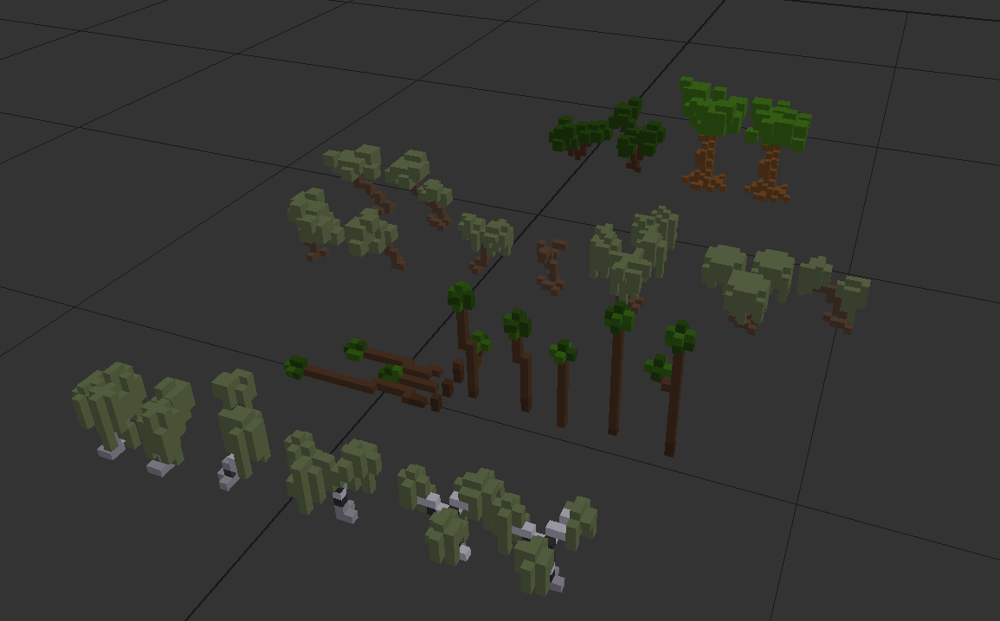
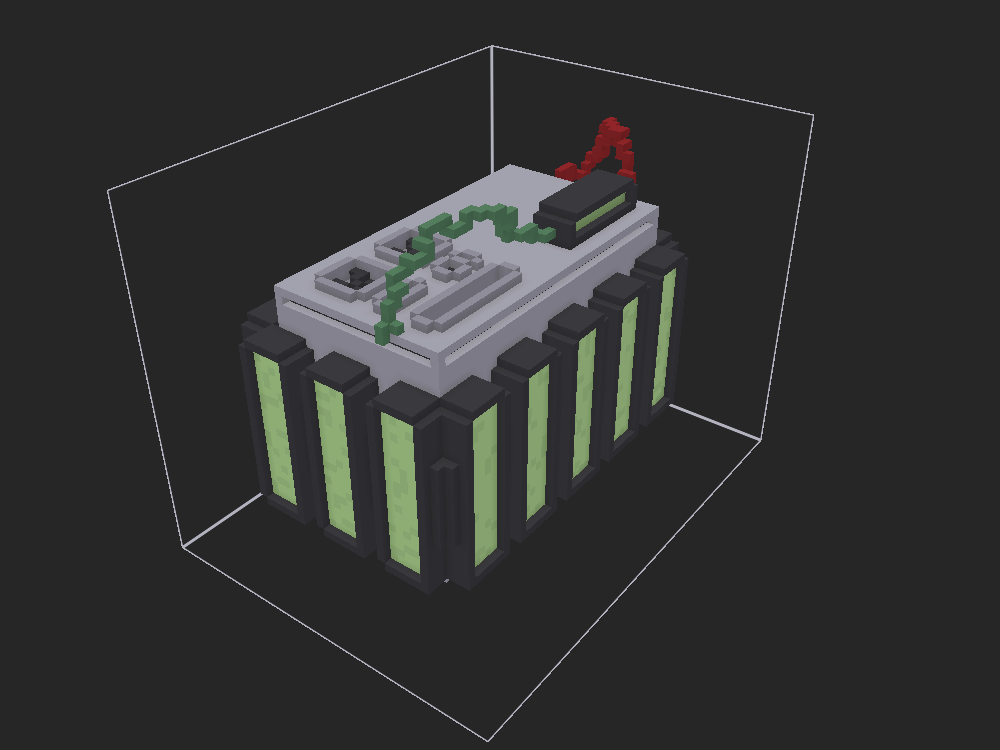
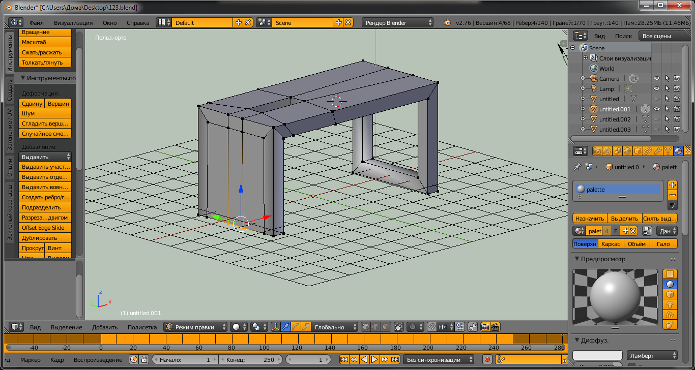

---

The development of the game spiked my interest in adjacent projects:
- [Hexagon](https://github.com/AnanasikDev/Hexagon) - quality-of-life utility library for Unity C#. Started as a tiny helper, it eventually grew into a larger library, that Compile, Recycle Factory and other big projects of mine heavily rely on.
- [Willow](https://github.com/AnanasikDev/Willow) - 3D terrain tool to place objects with highly customizable settings. Mostly used for vegetation and props. It was my first ever engine tool. Not sure if it ever made it to TSE itself though.
- [FPS debugger](https://github.com/AnanasikDev/FrameRateDebugger) - tiny helper to fix fps to a specified value for debugging
- [Easy Debug](https://github.com/AnanasikDev/EasyDebug) - similar fate as Hexagon. Started as a couple of functions to use unity console more easily (I, for some reason, used to fight C# syntax and try make it similar to Python). It then grew to a much more complicated debugging toolset with restrained-mode gizmos, pipe console, debug information located in the world along with objects, custom serialization.
- Debris - almost immediately dead procedural destruction system. I was really inspired by Unreal Engine at the time, and really wanted to create a replacement for Chaos Physics. I wasn't really good at programming, math or physics at the time, so the project was quickly deemed way outside my capabilities and project scope.
- Character Controller - a big asset I worked on for a few months, it was aimed at making a customizable and flexible 3D first-person character physically-correct movement system, with laying, crouching, walking, running, sprinting, jumping, climbing, using ziplines, swimming, taking fall damage, interacting with doors and other objects, parcour, and body animations. Pretty impressive for such an early project, but, having built on top of some existing third-party asset, I managed most of that. Because of the use of external assets though, I decided to leave it private. It made into TSE but development cut short after that since I got really tired from character programming.

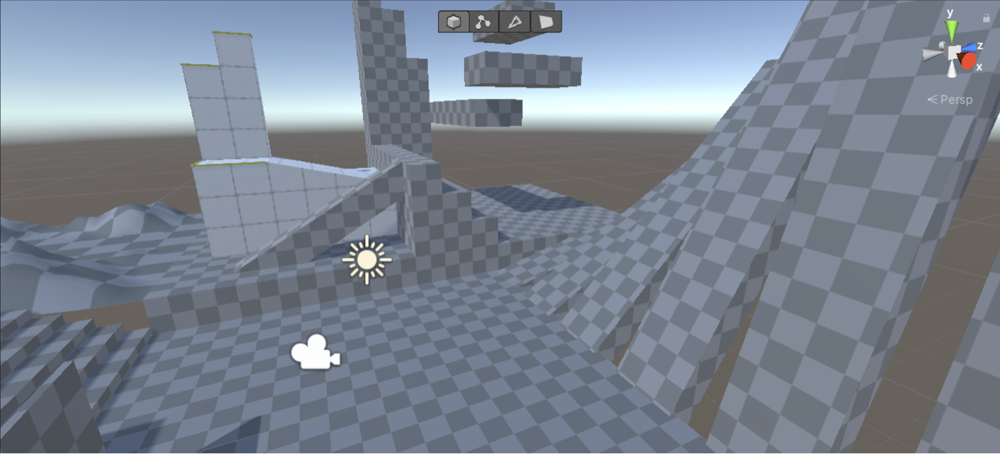
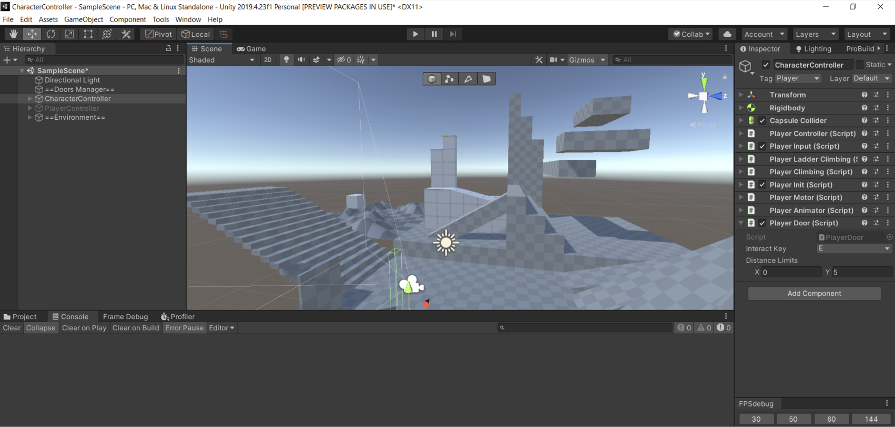

---

Still can't believe I did all that when was so young and inexperienced. Especially the community and leadership stuff.