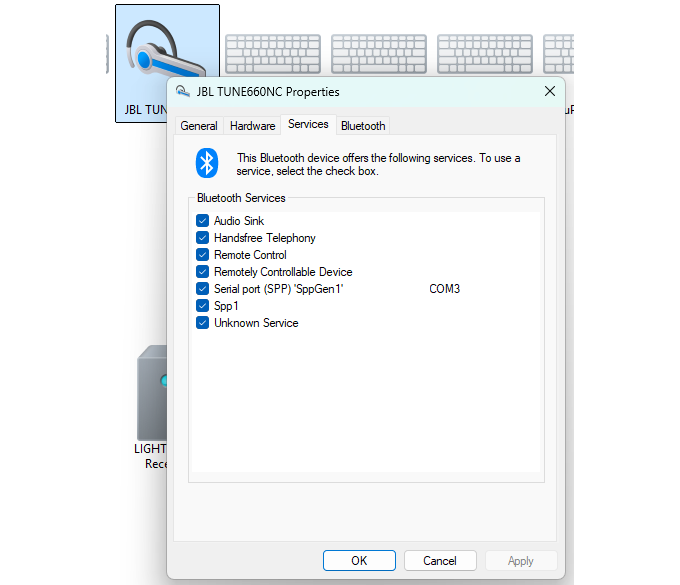
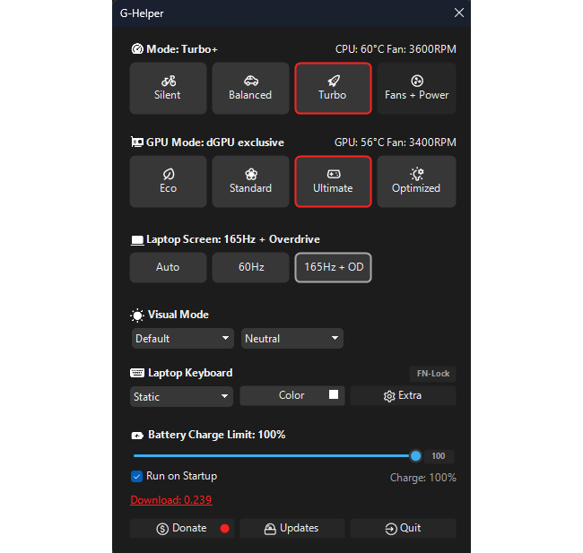
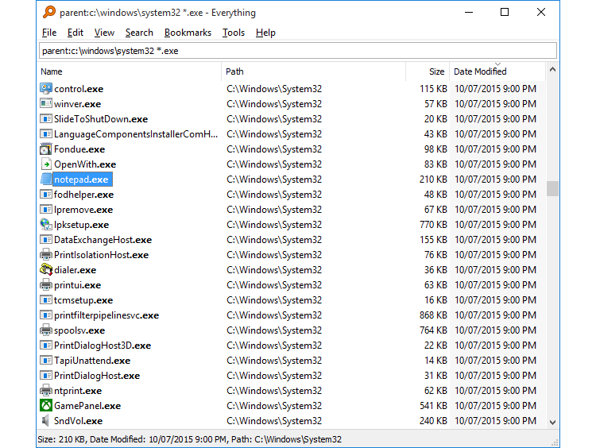
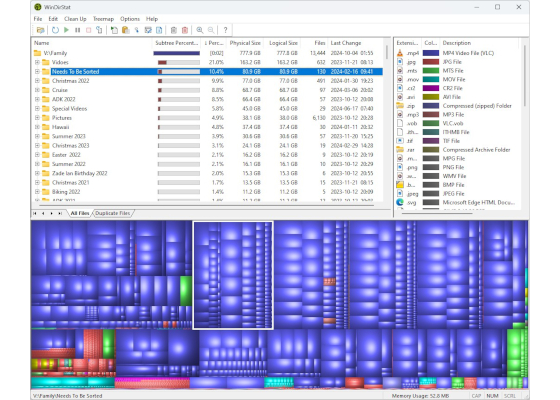
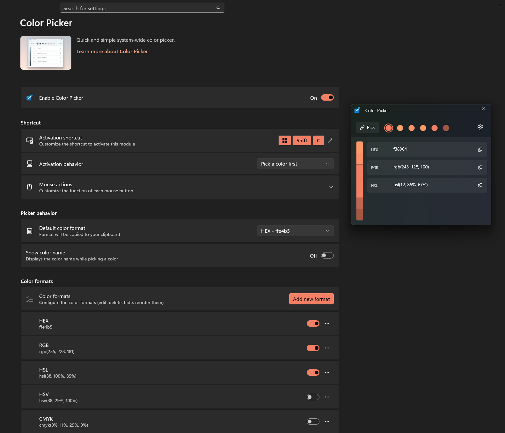

# Windows Home 11: hacks and tricks I found useful for myself over years

## My Windows (11) licence supports only one language, how do I change it?

## My bluetooth headphones sound terrible (when mic is enabled)

Apparently, bluetooth barely works with BOTH input and output audio. Either one works fine on its own, but when both are turned on, the incoming audio sounds like coming from a submerged barrel.

One option I found working for me is to completely disable this "feature" in the bluetooth device properties, as shown on the following picture. You can find this setting at Win - Settings - Bluetooth & devices - Devices - (scroll down) More devices and printer settings - *your device name* - Properties (or double left-click) - Services - Handsfree Telephony must be TURNED OFF.

## Remove desktop background entry

## GHelper

> Asus fan control utility

For Asus users GHelper is a handy utility that allows to control fan speed, modes, display refresh rate and other things you wish were adjustable out of the box.

[Official website](https://g-helper.com/)

## Everything

> File search system

`Everything` is a powerful tool for searching files. Windows searching system is very slow and not flexible, so `Everything` comes in handy a lot. You can search within a specific folder, use pattern matching (for example to find files of some extension - *.png etc), search within files contents using contents:blablabla at the end.

[Official website](https://www.voidtools.com/)

## Windirstat

> Disk space analyzer

Incredibly helpful to identify and fix problems with lack of free disk space. You can easily see what directories and files take up a lot of space and clean that up.

[Official website](https://windirstat.org/)

## Geek cleaner

A better way to delete apps: it sorts them for you, so you have a better image of which apps take up more space, plus it deletes all related data and registry entries which keeps your system neater.

## Power toys

Beautiful software with a lot of powerful features. It is developed by Microsoft itself but kept free and open-source on [github](https://github.com/microsoft/PowerToys)

### Color picker

`Win` + `Shift` + `C`

### Keyboard manager

Allows to set keybindings, which I myself use to use `Home` on a 60% keyboard without the physical `Home` button.

### Mouse Crosshairs

Mostly just an accessibility feature but may be useful sometimes when working on graphics to see coordinates and horizontal/vertical lines clearer.

### Peek

`Ctrl` + `Space` - on a file will bring up its preview, which is faster than opening a default image viewing software or a notebook.

### Text extractor

`Win` + `Shift` + `T` - you can select a rectangle on your screen and it will bring the texts recognized on the image into your clipboard.

### Shortcut guide

`Win` + `Shift` + `/` - brings up a 

## Pot player

Sometimes Windows (Home) cannot play a video rendered with specific encoders - but Pot Player can.

## Get PC info

`Win` + `R` -> msinfo32